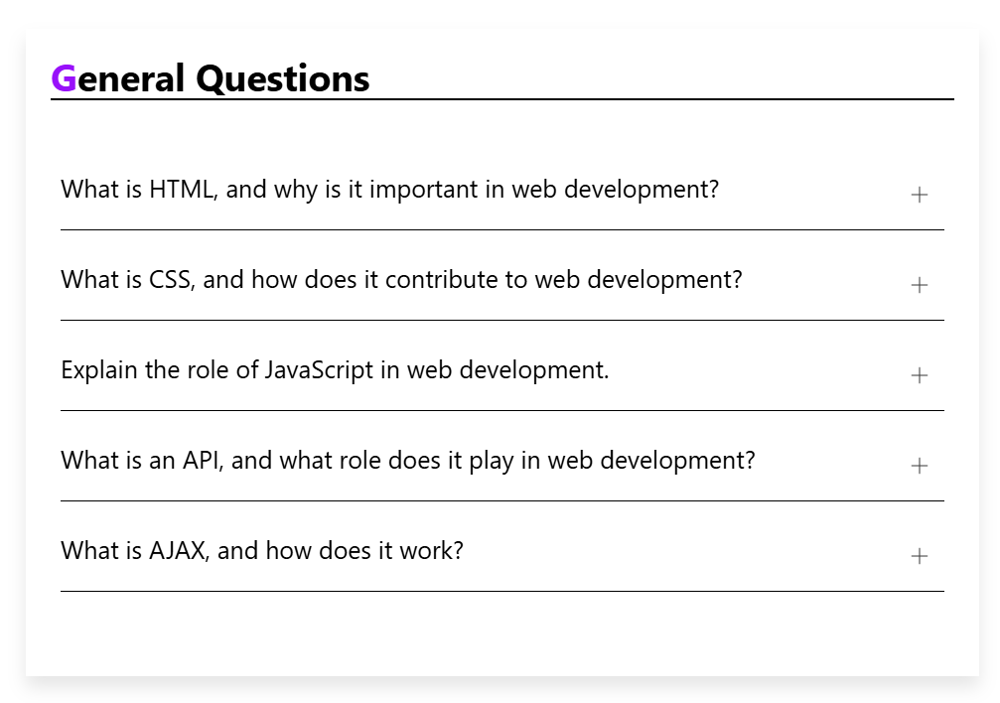

This project contains 2 Components

1. App.js: It acts as the parent Component and contains FAQ dummy data(faqList) and manages the state of the open FAQ.
   Also, renders the FAQ list by mapping over the data and passing props to the FAQ component.

2. FAQ.js: It acts as a child component that represents a single FAQ item and displays the question and answers. The answer is shown or hidden based on the isOpen prop. It also contains a toggle button to expand and collapse the answer.

### Project Preview

